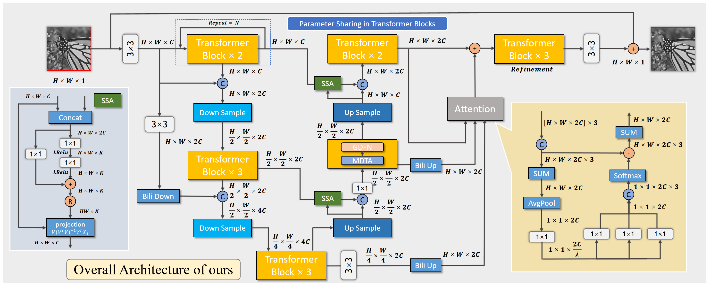

# Restormer-Skff-SSA Denosing Network

### Table of contents
  * [Network Architecture](#network)
  * [Experimental Results](#result)
  * [Dependencies](#dependencies)
  * [Model](#model)
  * [Test](#test)
  

## Network Architecture
**Encoder-Decoder Residual Network (EDRN)**  

## MEGVII2022 Real Denosing Challenge Results  
**Quantitative Results**  

 Method | PSNR (dB) | Score
 :---------------:|:----------:|:---------:
 (ours) | 43.87 | 9.00

# About Our Source Code & Trained Model
## Dependencies
  * Python==3.7
  * MegEngine==1.8.2
  
Our code is tested on Ubuntu 18.04 environment with an NVIDIA RTX 3090 GPU.

## Check model parameter
`$ python model.py`

## Test
Quick start (Demo) to reproduce our results.
Fix test_dir=='YOUR TEST DIR'

`$ python prdict.py`
